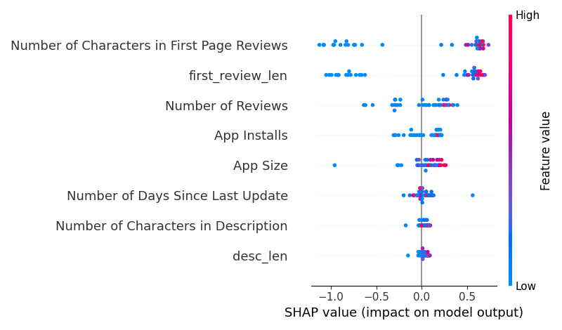

# XAI-Based Cultural Heritage App Prediction

## Overview
This project uses machine learning and Explainable AI (XAI) to predict cultural heritage app engagement and understand key influencing factors.

## Key Features
- Built using XGBoost for high-performance prediction
- Achieved ~93.7% accuracy
- Implemented SHAP and LIME for model explainability
- Identified important features affecting predictions

## Tech Stack
Python, Pandas, NumPy, scikit-learn, XGBoost, SHAP, LIME, Matplotlib

## Workflow
1. Data preprocessing and cleaning
2. Feature engineering
3. Model training (XGBoost)
4. Model evaluation
5. Explainability using SHAP & LIME

## Results
- Accuracy: ~93.7%
- Top features: engagement metrics, metadata

## Output
- SHAP summary plots
- LIME explanations
- Model performance metrics

## How to Run
pip install -r requirements.txt
Run the notebook or script

## Sample Output

### SHAP Visualization

### Model Performance
See detailed results in: `output/results.csv`
